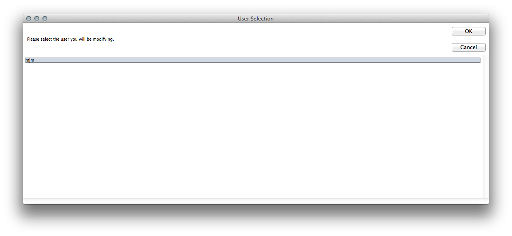
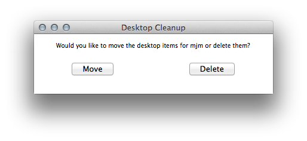
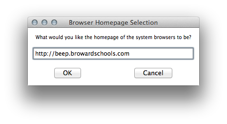
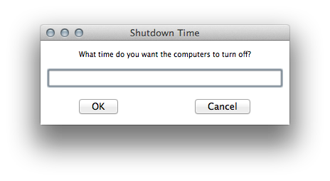

# BCPS Mac Refresher
## Overview
The **BCPS Mac Refresher** is an application designed to clean up a Apple workstation that has built up some rot over time, specifically student workstations.

### Features
#### Select User to Modify
Allows you to select the user you wish to modify with the refresher package. This account will usually be **student**.

#### Move or Delete Desktop Files
Allows you to select whether or not the refresher package will move or delete the selected users files that reside on their desktop.

#### Browser Homepage Selection
Allows you to select the default homepage for both Safari and Firefox in the selected users profile.

#### Set Power Management Settings
Allows you to set the startup and shutdown time for the computer. The time is represented in standard time format. *Eg. 7:00AM or 5:00PM*.

